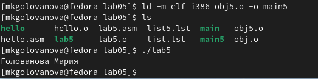

---
## Front matter
title: "Лабораторная работа №5"
subtitle: "Архитектура компьютера"
author: "Голованова Мария Константиновна"

## Generic otions
lang: ru-RU
toc-title: "Содержание"

## Bibliography
bibliography: bib/cite.bib
csl: pandoc/csl/gost-r-7-0-5-2008-numeric.csl

## Pdf output format
toc: true # Table of contents
toc-depth: 2
lof: true # List of figures
lot: true # List of tables
fontsize: 12pt
linestretch: 1.5
papersize: a4
documentclass: scrreprt
## I18n polyglossia
polyglossia-lang:
  name: russian
  options:
	- spelling=modern
	- babelshorthands=true
polyglossia-otherlangs:
  name: english
## I18n babel
babel-lang: russian
babel-otherlangs: english
## Fonts
mainfont: PT Serif
romanfont: PT Serif
sansfont: PT Sans
monofont: PT Mono
mainfontoptions: Ligatures=TeX
romanfontoptions: Ligatures=TeX
sansfontoptions: Ligatures=TeX,Scale=MatchLowercase
monofontoptions: Scale=MatchLowercase,Scale=0.9
## Biblatex
biblatex: true
biblio-style: "gost-numeric"
biblatexoptions:
  - parentracker=true
  - backend=biber
  - hyperref=auto
  - language=auto
  - autolang=other*
  - citestyle=gost-numeric
## Pandoc-crossref LaTeX customization
figureTitle: "Рис."
tableTitle: "Таблица"
listingTitle: "Листинг"
lofTitle: "Список иллюстраций"
lotTitle: "Список таблиц"
lolTitle: "Листинги"
## Misc options
indent: true
header-includes:
  - \usepackage{indentfirst}
  - \usepackage{float} # keep figures where there are in the text
  - \floatplacement{figure}{H} # keep figures where there are in the text
---

# Цель работы

Освоение процедуры компиляции и сборки программ, написанных на ассемблере NASM.

# Задание

# Теоретическое введение

# Выполнение лабораторной работы

## Программа Hello world!

 Я создала каталог для работы с программами на языке ассемблера NASM и перешла в созданный каталог.(рис. [-@fig:001]).

{ #fig:001 width=70% }

Я создала текстовый файл с именем hello.asm и открыла этот файл с помощью  текстового редактора gedit (рис. [-@fig:002]). 

{ #fig:002 width=70% }

Я ввела в файл текст (рис. [-@fig:003]).

{ #fig:003 width=70% }

## Транслятор NASM

Я провела компиляцию приведённого выше текста программы «Hello World» и с помощью команды ls проверила, что объектный файл был создан (рис. [-@fig:004]).

{ #fig:004 width=70% }

Транслятор преобразовал текст программы из файла hello.asm в объектный код, который записался в данный объектный файл.
Объектный файл имеет имя hello.o. 

## Расширенный синтаксис командной строки NASM

Я скомпилировала исходный файл hello.asm в obj.o и создала файл листинга list.lst, выполнив команду nasm -o obj.o -f elf -g -l list.lst hello.asm, и с помощью команды ls проверила, что файлы были созданы (рис. [-@fig:005]).

{ #fig:005 width=70% }

## Компоновщик LD

Я передала объектный файл на обработку компоновщику и с помощью команды ls проверила, что исполняемый файл hello был создан (рис. [-@fig:006]).

{ #fig:006 width=70% }

Я выполнила команду ld -m elf_i386 obj.o -o main и с помощью команды ls проверила, что исполняемый файл был создан (рис. [-@fig:007]). Исполняемый файл был собран из файла obj.o и имеет имя main.

{ #fig:007 width=70% }

## Запуск исполняемого файла
Я запустила на выполнение созданный исполняемый файл, находящийся в текущем каталоге, набрав в командной строке (рис. [-@fig:008]):
./hello
Программа вывела на экран сообщение Hello world! 

{ #fig:008 width=70% }

# Задание для самостоятельной работы

1. Я создала в каталоге ~/work/arch-pc/lab05 с помощью команды cp  копию файла hello.asm с именем lab5.asm (рис. [-@fig:009]).

{ #fig:009 width=70% }

2. С помощью текстового редактора gedit я внесла изменения в текст программы в файле lab5.asm так, чтобы вместо Hello world! на экран выводилась строка с моими фамилией и именем (рис. [-@fig:010]).

{ #fig:010 width=70% }

3. Я оттранслировала полученный текст программы lab5.asm в объектный файл, выполнила компоновку объектного файла и запустила получившийся исполняемый файл (рис. [-@fig:011], рис. [-@fig:012], рис. [-@fig:013], рис. [-@fig:014]).

{ #fig:011 width=70% }

{ #fig:012 width=70% }

{ #fig:013 width=70% }

{ #fig:014 width=70% }

4. Я скопировала файлы hello.asm и lab5.asm в мой локальный репозиторий в каталог ~/work/study/2022-2023/"Архитектура компьютера"/arch-pc/labs/lab05/ и загрузила файлы на Github (рис. [-@fig:015]).

{ #fig:015 width=70% }

# Выводы

Я освоила процедуры компиляции и сборки программ, написанных на ассемблере NASM.

# Список литературы{.unnumbered}

::: {#refs}
:::
