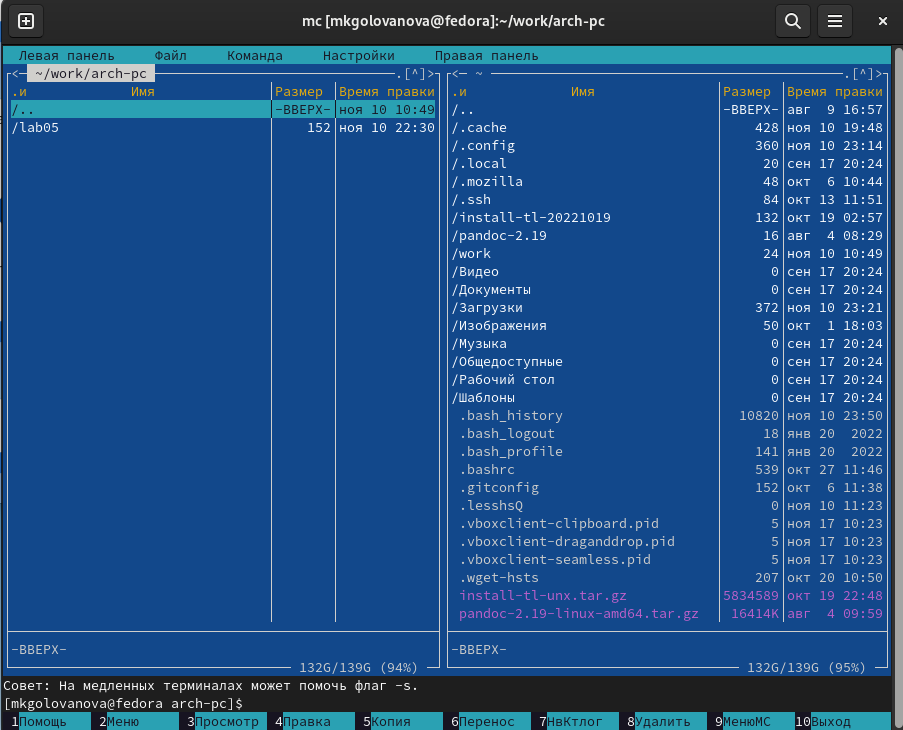

---
## Front matter
title: "Лабораторная работа №6"
subtitle: "Архитектура компьютера"
author: "Голованова Мария Константиновна"

## Generic otions
lang: ru-RU
toc-title: "Содержание"

## Bibliography
bibliography: bib/cite.bib
csl: pandoc/csl/gost-r-7-0-5-2008-numeric.csl

## Pdf output format
toc: true # Table of contents
toc-depth: 2
lof: true # List of figures
lot: true # List of tables
fontsize: 12pt
linestretch: 1.5
papersize: a4
documentclass: scrreprt
## I18n polyglossia
polyglossia-lang:
  name: russian
  options:
	- spelling=modern
	- babelshorthands=true
polyglossia-otherlangs:
  name: english
## I18n babel
babel-lang: russian
babel-otherlangs: english
## Fonts
mainfont: PT Serif
romanfont: PT Serif
sansfont: PT Sans
monofont: PT Mono
mainfontoptions: Ligatures=TeX
romanfontoptions: Ligatures=TeX
sansfontoptions: Ligatures=TeX,Scale=MatchLowercase
monofontoptions: Scale=MatchLowercase,Scale=0.9
## Biblatex
biblatex: true
biblio-style: "gost-numeric"
biblatexoptions:
  - parentracker=true
  - backend=biber
  - hyperref=auto
  - language=auto
  - autolang=other*
  - citestyle=gost-numeric
## Pandoc-crossref LaTeX customization
figureTitle: "Рис."
tableTitle: "Таблица"
listingTitle: "Листинг"
lofTitle: "Список иллюстраций"
lotTitle: "Список таблиц"
lolTitle: "Листинги"
## Misc options
indent: true
header-includes:
  - \usepackage{indentfirst}
  - \usepackage{float} # keep figures where there are in the text
  - \floatplacement{figure}{H} # keep figures where there are in the text
---

# Цель работы

Приобретение практических навыков работы в Midnight Commander. Освоение инструкций языка ассемблера mov и int.

# Задание

Создать программу вывода сообщения на экран и ввода строки с клавиатуры, программу вывода сообщения на экран и ввода строки с клавиатуры с использованием файла in_out.asm.
Создать программу вывода сообщения на экран, ввода строки с клавиатуры и вывода введённой строки на экран, программу вывода сообщения на экран, ввода строки с клавиатуры и вывода введённой строки на экран с использованием файла in_out.asm.

# Теоретическое введение

Midnight Commander (или mc) — это консольный файловый менеджер для Linux. Он является программой, позволяющей просматривать структуру каталогов и выполнять основные операции по управлению файловой системой. Midnight Commander позволяет сделать работу с файлами более удобной и наглядной.

# Выполнение лабораторной работы

Я открыла Midnight Commander (user@dk4n31:~$ mc) и, пользуясь клавишами ↑(вверх) , ↓(вниз) и Enter перешла в каталог ~/work/arch-pc, созданный при выполнении лабораторной работы (рис. [-@fig:001]).

{ #fig:001 width=70% }

С помощью функциональной клавиши F7 я создала папку lab06  и перешла в созданный каталог (рис. [-@fig:002]).

{ #fig:002 width=70% }

Пользуясь строкой ввода и командой touch я создала файл lab6-1.asm (рис. [-@fig:003]).

{ #fig:003 width=70% }

С помощью функциональной клавиши F4 откройте файл lab6-1.asm для редактирования во встроенном редакторе (nano) (рис. [-@fig:004]).

{ #fig:004 width=70% }

Я ввела текст программы из листинга 6.1 (рис. [-@fig:005]), сохранила изменения и закрыла файл (Ctrl + x( выход) > Y (сохранить изменения) > Enter).

{ #fig:005 width=70% }

С помощью функциональной клавиши F3 я открыла файл lab6-1.asm для просмотра и убедилась, что файл содержит текст программы (рис. [-@fig:006]).

{ #fig:006 width=70% }

Я оттранслировала текст программы lab6-1.asm в объектный файл, выполнила компоновку объектного файла и запустила получившийся исполняемый файл. Программа вывела строку 'Введите строку:' и ожидала ввода с клавиатуры. На запрос ввела мои ФИО (рис. [-@fig:007]).

{ #fig:007 width=70% }

Я скачала файл in_out.asm со страницы курса в ТУИС.
В одной из панелей mc я открыла каталог с файлом lab6-1.asm, в другой панели - каталог со скачанным файлом in_out.asm и скопировала файл in_out.asm в каталог с файлом lab6-1.asm с помощью функциональной клавиши F5 (рис. [-@fig:008]).

{ #fig:008 width=70% }

С помощью функциональной клавиши F5 я создала копию файла lab6-1.asm с именем lab6-2.asm. Я выделитла файл lab6-1.asm, нажала клавишу F5 , введла имя файла lab6-2.asm и нажала клавишу Enter (рис. [-@fig:009]).

{ #fig:009 width=70% }

Я исправила текст программы в файле lab6-2.asm с использованием подпрограмм из внешнего файла in_out.asm (использовала подпрограммы sprintLF, sread и quit) в соответствии с листингом 6.2, создала исполняемый файл и проверила его работу (рис. [-@fig:010], рис. [-@fig:011]).

{ #fig:010 width=70% }

{ #fig:011 width=70% }

Я заменила в файле lab6-2.asm подпрограмму sprintLF на sprint, создала исполняемый файл и проверила его работу (рис. [-@fig:012], рис. [-@fig:013]). После этого программа перестала переводить строку для ввода с клавиатуры после вывода строки 'Введите строку:'.

{ #fig:012 width=70% }

{ #fig:013 width=70% }

# Выполнение самостоятельной работы

Я создала копию файла lab6-1.asm с именем lab6-1-1.asm и внесла изменения в программу (без использования внешнего файла in_out.asm) так, чтобы она работала по следующему алгоритму (рис. [-@fig:014], рис. [-@fig:015]):
1. вывести приглашение типа “Введите строку:”;
2. ввести строку с клавиатуры;
3. вывести введённую строку на экран.

{ #fig:014 width=70% }

{ #fig:015 width=70% }

Я получила исполняемый файл и проверила его работу. На приглашение ввести строку ввела свою фамилию (рис. [-@fig:016]).

{ #fig:016 width=70% }

Я создала копию файла lab6-2.asm с именем lab6-2-2.asm и исправила текст программы с использование подпрограмм из внешнего файла in_out.asm так, чтобы она работала по следующему алгоритму (рис. [-@fig:017], рис. [-@fig:018]):
 1. вывести приглашение типа “Введите строку:”;
 2. ввести строку с клавиатуры;
 3. вывести введённую строку на экран.

{ #fig:017 width=70% }

{ #fig:018 width=70% }

Я создала исполняемый файл и проверила его работу. На приглашение ввести строку ввела свою фамилию (рис. [-@fig:019]).

{ #fig:019 width=70% }

# Выводы

Я приобрела практические навыки работы в Midnight Commander и освоила инструкции языка ассемблера mov и int.

