---
## Front matter
title: "Лабораторная работа №7"
subtitle: "Архитектура компьютера"
author: "Голованова Мария Константиновна"

## Generic otions
lang: ru-RU
toc-title: "Содержание"

## Bibliography
bibliography: bib/cite.bib
csl: pandoc/csl/gost-r-7-0-5-2008-numeric.csl

## Pdf output format
toc: true # Table of contentsГолованова Мария Константиновна
toc-depth: 2
lof: true # List of figures
lot: true # List of tables
fontsize: 12pt
linestretch: 1.5
papersize: a4
documentclass: scrreprt
## I18n polyglossia
polyglossia-lang:
  name: russian
  options:
	- spelling=modern
	- babelshorthands=true
polyglossia-otherlangs:
  name: english
## I18n babel
babel-lang: russian
babel-otherlangs: english
## Fonts
mainfont: PT Serif
romanfont: PT Serif
sansfont: PT Sans
monofont: PT Mono
mainfontoptions: Ligatures=TeX
romanfontoptions: Ligatures=TeX
sansfontoptions: Ligatures=TeX,Scale=MatchLowercase
monofontoptions: Scale=MatchLowercase,Scale=0.9
## Biblatex
biblatex: true
biblio-style: "gost-numeric"
biblatexoptions:
  - parentracker=true
  - backend=biber
  - hyperref=auto
  - language=auto
  - autolang=other*
  - citestyle=gost-numeric
## Pandoc-crossref LaTeX customization
figureTitle: "Рис."
tableTitle: "Таблица"
listingTitle: "Листинг"
lofTitle: "Список иллюстраций"
lotTitle: "Список таблиц"
lolTitle: "Листинги"
## Misc options
indent: true
header-includes:
  - \usepackage{indentfirst}
  - \usepackage{float} # keep figures where there are in the text
  - \floatplacement{figure}{H} # keep figures where there are in the text
---

# Цель работы

Освоение арифметических инструкций языка ассемблера NASM.

# Задание

Создать программы вывода символьных и численных значений, программы вычисления арифметических выражений. 
Создать программу вычисления выражения y = f(x), выбрав вариант из таблицы 7.3 по номеру, полученному в  при выполнении лабораторной работы.

# Теоретическое введение

Арифметические инструкций языка ассемблера NASM - операции, позволяющие производить арифметические вычисления в ассемблере. К ним относятся такие операции как команда целочисленного сложения add, команда целочисленного вычитания sub, команды инкремента и декремента inc (от англ. increment) и dec (от англ. decrement), команда изменения знака операнда neg, команды умножения mul и imu, команды деления div и idiv
.
# Выполнение лабораторной работы

## Символьные и численные данные в NASM

Я создала каталог для программам лабораторной работы №7, перешла в него и создала файл lab7-1.asm (рис. [-@fig:001]).

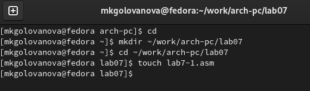{ #fig:001 width=70% }

Я введла в файл lab7-1.asm текст программы из листинга 7.1 (рис. [-@fig:002]). 

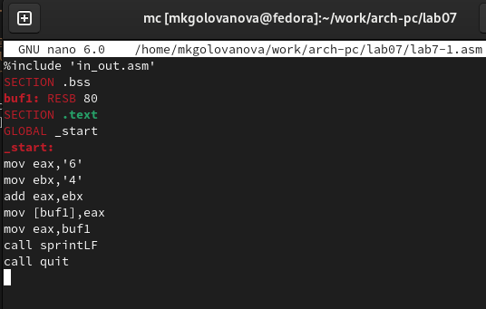{ #fig:002 width=70% }

Я создала исполняемый файл и запустите его (рис. [-@fig:003]).

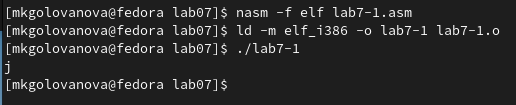{ #fig:003 width=70% }

В данном случае при выводе значения регистра eax я ожидала увидеть число 10. Однако результатом будет символ j. Это происходит потому, что кодсимвола 6 равен 00110110 в двоичном представлении (или 54 в десятичном представлении), а код символа 4 – 00110100 (52). Команда add eax,ebx записала в регистр eax сумму кодов – 01101010 (106), что в свою очередь является кодом символа j.
Я исправила текст программы и вместо символов записала в регистры числа, заменив строки 
mov eax,'6'
mov ebx,'4'
на строки
mov eax,6
mov ebx,4 (рис. [-@fig:004]).

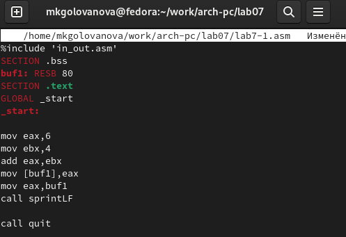{ #fig:004 width=70% }

Я создала исполняемый файл и запустила его (рис. [-@fig:005]).

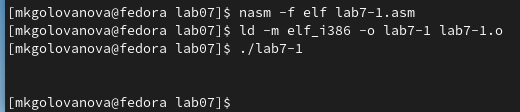{ #fig:005 width=70% }

В данном случае выводится символ с кодом 10. Пользуясь таблицей ASCII, я определа, что код 10 соответствует символу 'LF, /n', причём символ не отображается при выводе на экран.

Я создала файл lab7-2.asm в каталоге ~/work/arch-pc/lab07 и ввела в него текст программы из листинга 7.2 (рис. [-@fig:006], рис. [-@fig:007]).

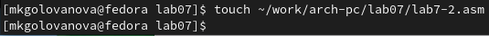{ #fig:006 width=70% }

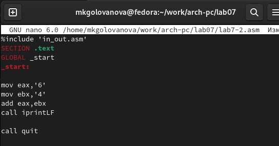{ #fig:007 width=70% }

Я создала исполняемый файл и запустила его (рис. [-@fig:008]).

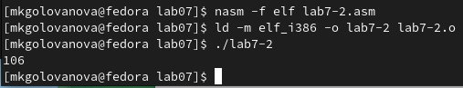{ #fig:008 width=70% }
 
В результате работы программы я получила число 106. В данном случае, как и в первом, команда add складывает коды символов ‘6’ и ‘4’ (54+52=106). Однако, в отличии от программы из листинга 7.1, функция iprintLF позволяет вывести число, а не символ, кодом которого является это число.
Я изменила символы на числа, заменив строки
mov eax,'6'
mov ebx,'4'
на строки
mov eax,6
mov ebx,4 (рис. [-@fig:009]).

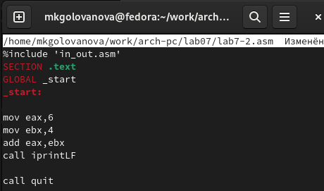{ #fig:009 width=70% }

Я создала исполняемый файл и запустила его (рис. [-@fig:010]).

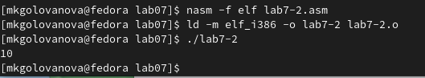{ #fig:010 width=70% }

В результате работы программы я получила число 10.
Я заменила функцию iprintLF на iprint, создала исполняемый файл и запустила его (рис. [-@fig:011], рис. [-@fig:012]). После вывода функция iprint в отличии от функции iprintLF не переводит строку.

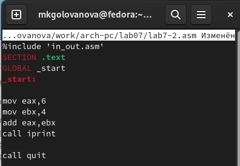{ #fig:011 width=70% }

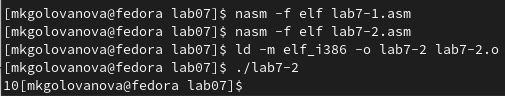{ #fig:012 width=70% }

## Выполнение арифметических операций в NASM

В качестве примера выполнения арифметических операций в NASM я рассмотрела программу вычисления арифметического выражения  f(x) = (5 * 2 + 3)/3.
Я создала файл lab7-3.asm в каталоге ~/work/arch-pc/lab07 (рис. [-@fig:013]).

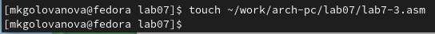{ #fig:013 width=70% }

Я внимательно изучила текст программы из листинга 7.3 и ввела в lab7-3.asm (рис. [-@fig:014])

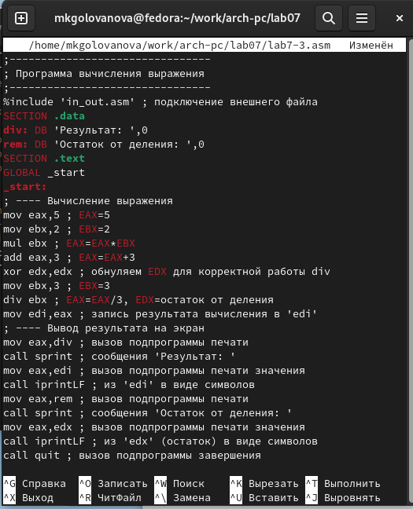{ #fig:014 width=70% }

Я создала исполняемый файл и запустила его (рис. [-@fig:015]).

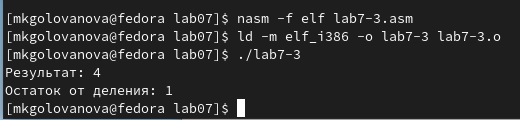{ #fig:015 width=70% }

Я изменила текст программы для вычисления выражения f(x) = (4 * 6 + 2)/5, создала исполняемый файл и проверила его работу (рис. [-@fig:016], рис. [-@fig:017]).

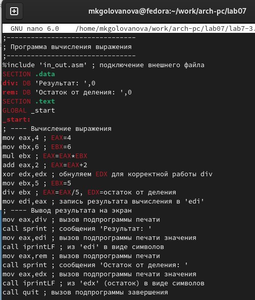{ #fig:016 width=70% }

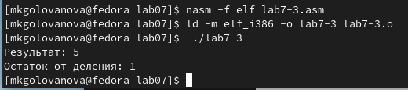{ #fig:017 width=70% }

В качестве другого примера я рассмотрела программу вычисления варианта задания по номеру студенческого билета, работающую по следующему
алгоритму:
• вывести запрос на введение No студенческого билета;
• вычислить номер варианта по формуле: (Sn mod 20) + 1, где Sn – номер студенческого билета (В данном случае a mod b – это остаток
от деления a на b);
• вывести на экран номер варианта.
Я создала файл variant.asm в каталоге ~/work/arch-pc/lab07 (рис. [-@fig:018]).

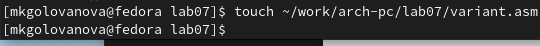{ #fig:018 width=70% }

Внимательно изучите текст программы из листинга 7.4 и введите в файл variant.asm (рис. [-@fig:019]).

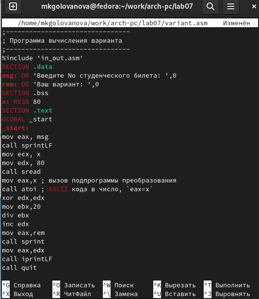{ #fig:019 width=70% }

Я создала исполняемый файл и запустила его (рис. [-@fig:020]).

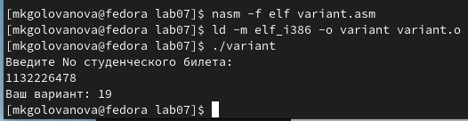{ #fig:020 width=70% }

Я проверила результат работы программы, вычислив номер варианта аналитически. Ответы на вопросы:
1. За вывод на экран сообщения ‘Ваш вариант: ’ отвечают строки: 
mov eax,rem
call sprint
2. Инструкции nasm: mov ecx, x  означает запись адреса переменной в 'EAX', mov edx, 80 - запись длины вводимого сообщения в 'EBX', call sread - вызов подпрограммы ввода сообщения.
3. Инструкция “call atoi” используется для преобразования ASCII кода в число.
4. За вычисления варианта отвечают строки: 
xor edx,edx
mov ebx,20
div ebx
inc edx
5. Остаток от деления при выполнении инструкции “div ebx” записывается в регистр edx.
6. Инструкция “inc edx” используется для прибавления к числу единицы.
7. За вывод на экран результата вычислений отвечают строки:
mov eax,edx
call iprintLF

# Выполнение самостоятельной работы

Я создала файл var19.asm и написала в нём программу вычисления выражения y = f(x) так, чтобы она выводила выражение для вычисления, выводила запрос на ввод значения x, вычисляла заданное выражение в зависимости от введенного x, выводила результат вычислений (рис. [-@fig:021], рис. [-@fig:022]). Вид функции f(x) я выбрала из таблицы 7.3 вариантов заданий в соответствии с номером, полученным мной при выполнении лабораторной работы (Вариант №19: ( 1/3 * x + 5) * 7, x1=3, x2=9)(рис. [-@fig:023]). 

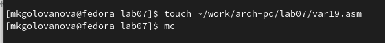{ #fig:021 width=70% }

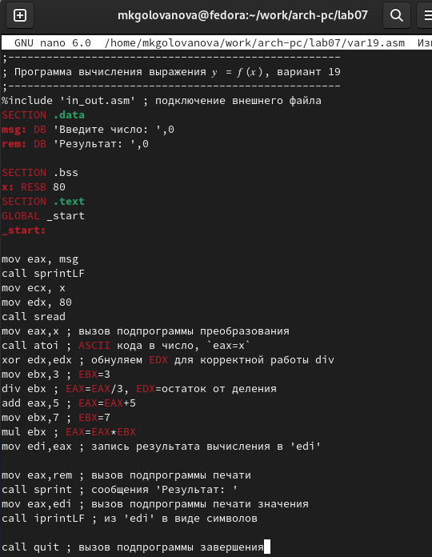{ #fig:022 width=70% }

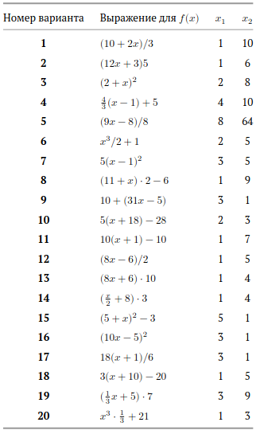{ #fig:023 width=70% }

Я создала исполняемый файл и проверила его работу для значений x1 и x2 из таблицы 7.3 (рис. [-@fig:024]).

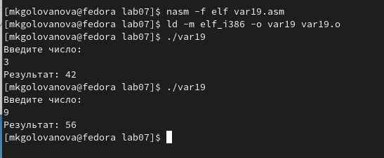{ #fig:024 width=70% }

# Выводы

Я освоила арифметические инструкций языка ассемблера NASM.
