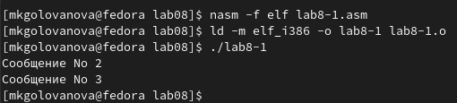

---
## Front matter
title: "Лабораторная работа №8"
subtitle: "Архитектура компьютера"
author: "Голованова Мария Константиновна"

## Generic otions
lang: ru-RU
toc-title: "Содержание"

## Bibliography
bibliography: bib/cite.bib
csl: pandoc/csl/gost-r-7-0-5-2008-numeric.csl

## Pdf output format
toc: true # Table of contents
toc-depth: 2
lof: true # List of figures
lot: true # List of tables
fontsize: 12pt
linestretch: 1.5
papersize: a4
documentclass: scrreprt
## I18n polyglossia
polyglossia-lang:
  name: russian
  options:
	- spelling=modern
	- babelshorthands=true
polyglossia-otherlangs:
  name: english
## I18n babel
babel-lang: russian
babel-otherlangs: english
## Fonts
mainfont: PT Serif
romanfont: PT Serif
sansfont: PT Sans
monofont: PT Mono
mainfontoptions: Ligatures=TeX
romanfontoptions: Ligatures=TeX
sansfontoptions: Ligatures=TeX,Scale=MatchLowercase
monofontoptions: Scale=MatchLowercase,Scale=0.9
## Biblatex
biblatex: true
biblio-style: "gost-numeric"
biblatexoptions:
  - parentracker=true
  - backend=biber
  - hyperref=auto
  - language=auto
  - autolang=other*
  - citestyle=gost-numeric
## Pandoc-crossref LaTeX customization
figureTitle: "Рис."
tableTitle: "Таблица"
listingTitle: "Листинг"
lofTitle: "Список иллюстраций"
lotTitle: "Список таблиц"
lolTitle: "Листинги"
## Misc options
indent: true
header-includes:
  - \usepackage{indentfirst}
  - \usepackage{float} # keep figures where there are in the text
  - \floatplacement{figure}{H} # keep figures where there are in the text
---

# Цель работы

Изучение команд условного и безусловного переходов. Приобретение навыков написания программ с использованием переходов. Знакомство с назначением и структурой файла листинга.

# Задание

Изученить команды условного и безусловного переходов, написать программы, содержащие эти команды.

# Теоретическое введение

Для реализации ветвлений в ассемблере используются так называемые команды передачи управления или команды перехода. Выделяют 2 типа переходов: условный и безусловный. Условный переход – выполнение или невыполнение перехода в определенную точку программы в зависимости от проверки условия; безусловный переход – выполнение передачи управления в определенную точку программы без каких-либо условий.
Безусловный переход выполняется инструкцией jmp, команда имеет вид jmp <адрес_перехода>.
Команда условного перехода имеет вид j<мнемоника перехода> label, мнемоника перехода связана со значением анализируемых флагов или со способом их формирования.

# Выполнение лабораторной работы

## Реализация переходов в NASM

Я создала каталог для программам лабораторной работы №8, перешла в него и создала файл lab8-1.asm (рис. [-@fig:001]).

{ #fig:001 width=70% }

Я ввела в файл lab8-1.asm текст программы из листинга 8.1 (рис. [-@fig:002]).

{ #fig:002 width=70% }

Я создала исполняемый файл и запустила его (рис. [-@fig:003]).

{ #fig:003 width=70% }

Таким образом, использование инструкции jmp _label2 меняет порядок исполнения инструкций и позволяет выполнить инструкции начиная с метки _label2, пропустив вывод первого сообщения.
Инструкция jmp позволяет осуществлять переходы не только вперед, но и назад. Я изменила текст программы в соответствии с листингом 8.2, чтобы программа выводила сначала ‘Сообщение No 2’, потом ‘Сообщение No 1’ и завершала работу (рис. [-@fig:004]).

{ #fig:004 width=70% }

Я создала исполняемый файл и проверила его работу (рис. [-@fig:005]).

{ #fig:005 width=70% }

Я изменила текст программы, добавив и изменив инструкции jmp, чтобы программа выводила ‘Сообщение No 3’, потом ‘Сообщение No 2’, потом ‘Сообщение No 1’ и завершала работу (рис. [-@fig:006]).

{ #fig:006 width=70% }

Я создала исполняемый файл и проверила его работу (рис. [-@fig:007]).

{ #fig:007 width=70% }

Использование инструкции jmp приводит к переходу в любом случае. Однако, часто при написании программ необходимо использовать условные переходы (переход должен происходить если выполнено какое-либо условие). В качестве примера я рассмотрела программу, которая определяет и выводит на экран наибольшую из 3 целочисленных переменных: A,B и C. Значения для A и C задаются в программе, значение B вводиться с клавиатуры. 
Я создала файл lab8-2.asm в каталоге ~/work/arch-pc/lab08 (рис. [-@fig:008]), внимательно изучила текст программы из листинга 8.3 и ввела в lab8-2.asm (рис. [-@fig:009], рис. [-@fig:010]).

{ #fig:008 width=70% }

{ #fig:009 width=70% }

{ #fig:010 width=70% }

Я создала исполняемый файл и проверила его работу для разных значений B (рис. [-@fig:011]).

{ #fig:011 width=70% }

## Изучение структуры файла листинга

Обычно nasm создаёт в результате ассемблирования только объектный файл. Получить файл листинга можно, указав ключ -l и задав имя файла
листинга в командной строке. Я создала файл листинга для программы из файла lab8-2.asm (рис. [-@fig:012])

{ #fig:012 width=70% }

Я открыла файл листинга lab8-2.lst с помощью текстового редактора mcedit (mcedit lab8-2.lst)и внимательно ознакомилась с его форматом и содержимым (рис. [-@fig:013], рис. [-@fig:014], рис. [-@fig:015], рис. [-@fig:016], рис. [-@fig:017], рис. [-@fig:018])

{ #fig:013 width=70% }

{ #fig:014 width=70% }

{ #fig:015 width=70% }

{ #fig:016 width=70% }

{ #fig:017 width=70% }

{ #fig:018 width=70% }

Я рассмотрела содержимое последних трёх строк файла листинга:
47 00000163 A1[00000000}    mov eax,[max}
48 00000168 E819FFFFFF      call iprintLF ; Вывод 'max(A,B,C)'
49 0000016D E869FFFFFF      call quit ; Выход

47 - номер строки (не соответствует номеру строки в файле с исходным текстом программы), 00000163 - адрес строки (смещение машинного кода от начала текущего сегмента), A1[00000000} - машинный код (ассемблированная исходная строка в виде шестнадцатеричной последовательности), mov eax,[max} - исходный текст программы; 
48 - номер строки (не соответствует номеру строки в файле с исходным текстом программы), 00000168 - адрес строки, E819FFFFFF - машинный код, call iprintLF ; Вывод 'max(A,B,C)' - исходный текст программы; 
49 - номер строки (не соответствует номеру строки в файле с исходным текстом программы), 0000016D - адрес строки, E869FFFFFF - машинный код, call quit ; Выход - исходный текст программы. 

# Задание для самостоятельной работы

Я создала файл lab8-3.asm (рис. [-@fig:019]) и написала в нём программу нахождения наименьшей из 3 целочисленных переменных a,b и c (рис. [-@fig:020], рис. [-@fig:021]). Значения переменных выбрала из табл. 8.5 в соответствии с вариантом, полученным при выполнении лабораторной работы No 7(вариант 19).

{ #fig:019 width=70% }

{ #fig:020 width=70% }

{ #fig:021 width=70% }

Я создала исполняемый файл и проверила его работу (рис. [-@fig:022]).

{ #fig:022 width=70% }

# Выводы

Я изучила команды условного и безусловного переходов, приобрела навыки написания программ с использованием переходов и познакомилась с назначением и структурой файла листинга.

