---
## Front matter
title: "Лабораторная работа №9"
subtitle: "Архитектура компьютера"
author: "Голованова Мария Константиновна"

## Generic otions
lang: ru-RU
toc-title: "Содержание"

## Bibliography
bibliography: bib/cite.bib
csl: pandoc/csl/gost-r-7-0-5-2008-numeric.csl

## Pdf output format
toc: true # Table of contents
toc-depth: 2
lof: true # List of figures
lot: true # List of tables
fontsize: 12pt
linestretch: 1.5
papersize: a4
documentclass: scrreprt
## I18n polyglossia
polyglossia-lang:
  name: russian
  options:
	- spelling=modern
	- babelshorthands=true
polyglossia-otherlangs:
  name: english
## I18n babel
babel-lang: russian
babel-otherlangs: english
## Fonts
mainfont: PT Serif
romanfont: PT Serif
sansfont: PT Sans
monofont: PT Mono
mainfontoptions: Ligatures=TeX
romanfontoptions: Ligatures=TeX
sansfontoptions: Ligatures=TeX,Scale=MatchLowercase
monofontoptions: Scale=MatchLowercase,Scale=0.9
## Biblatex
biblatex: true
biblio-style: "gost-numeric"
biblatexoptions:
  - parentracker=true
  - backend=biber
  - hyperref=auto
  - language=auto
  - autolang=other*
  - citestyle=gost-numeric
## Pandoc-crossref LaTeX customization
figureTitle: "Рис."
tableTitle: "Таблица"
listingTitle: "Листинг"
lofTitle: "Список иллюстраций"
lotTitle: "Список таблиц"
lolTitle: "Листинги"
## Misc options
indent: true
header-includes:
  - \usepackage{indentfirst}
  - \usepackage{float} # keep figures where there are in the text
  - \floatplacement{figure}{H} # keep figures where there are in the text
---

# Цель работы

Приобретение навыков написания программ с использованием циклов и обработкой аргументов командной строки.

# Задание

Написать программы с использованием циклов и обработкой аргументов командной строки.
Написать программу, которая находит сумму значений функции f(x) для x = x1, x2, ..., xn (т. е. находит f(x1) + f(x2) +...+ f(xn)), где значения xi передаются как аргументы. 

# Теоретическое введение

Стек — это структура данных, организованная по принципу LIFO («Last In — First Out» или «последним пришёл — первым ушёл»). Основной функцией стека является функция сохранения адресов возврата и передачи аргументов при вызове процедур. Также в нём  выделяется память для локальных переменных и могут временно храниться значения регистров.
Стек имеет вершину, адрес последнего добавленного элемента, который хранится в регистре esp. Противоположный конец стека называется дном. Последнее добавленное в стек значение извлекается первым.
При помещении значения в стек указатель стека уменьшается, а при извлечении — увеличивается.
Для работы со стеком в процессоре есть специальные регистры (ss, bp, sp) и команды. Также для стека существует две основные операции: добавление элемента в вершину стека (push) и извлечение элемента из вершины стека (pop). 
Для организации циклов существуют специальные инструкции, для каждой максимальное количество проходов задаётся в регистре ecx. Наиболее простой является инструкция loop, которая позволяет организовать безусловный цикл. Она выполняется в два этапа. Сначала из регистра ecx вычитается единица и его значение сравнивается с нулём. Если регистр не равен нулю, то выполняется переход к указанной метке, если равен, то переход не выполняется и управление передаётся команде, следующей сразу после команды loop.

# Выполнение лабораторной работы

## Реализация циклов в NASM

Я создала каталог для программам лабораторной работы №9, перешла в него и создала файл lab9-1.asm (рис. [-@fig:001]).

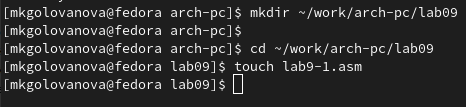{ #fig:001 width=70% }

При реализации циклов в NASM с использованием инструкции loop необходимо помнить о том, что эта инструкция использует регистр ecx в качестве счетчика и на каждом шаге уменьшает его значение на единицу. В качестве примера я рассмотрела программу, выводящую значение регистра ecx. Я внимательно изучила текст программы листинга 9.1 и ввела его в файл lab9-1.asm (рис. [-@fig:002]).

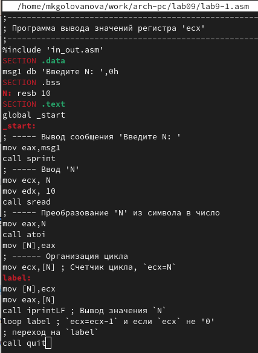{ #fig:002 width=70% }

Я создала исполняемый файл и проверила его работу (рис. [-@fig:003]).

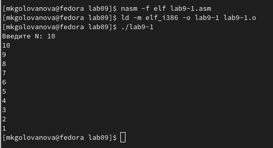{ #fig:003 width=70% }

Данный пример показывает, что использование регистра ecx в теле цилка loop может привести к некорректной работе программы. Я изменила текст программы, добавив изменение значение регистра ecx в цикле (рис. [-@fig:004]).

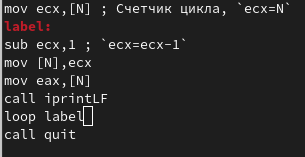{ #fig:004 width=70% }

Я создала исполняемый файл и проверила его работу (рис. [-@fig:005]). Регистр ecx принимает в цикле значения, которые не могут входить в N (слишком большие для введённого N). Число проходов цикла не соответствует значению N, введенному с клавиатуры.

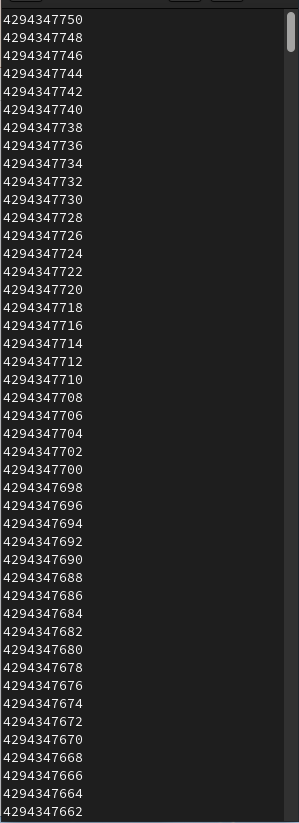{ #fig:005 width=70% }

Для использования регистра ecx в цикле и сохранения корректности работы программы можно использовать стек. Я внесла изменения в текст программы, добавив команды push и pop (добавления в стек и извлечения из стека) для сохранения значения счетчика цикла loop (рис. [-@fig:006]).

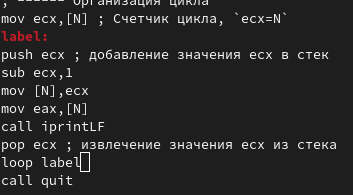{ #fig:006 width=70% }

Я создала исполняемый файл и проверила его работу (рис. [-@fig:007]). В данном случае число проходов цикла соответствует значению N, введенному с клавиатуры.

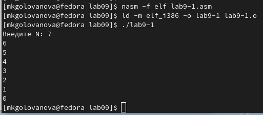{ #fig:007 width=70% }

## Обработка аргументов командной строки

При разработке программ иногда встает необходимость указывать аргументы, которые будут использоваться в программе, непосредственно из командной строки при запуске программы.
При запуске программы в NASM аргументы командной строки загружаются в стек в обратном порядке, кроме того в стек записывается имя программы и общее количество аргументов. Последние два элемента стека для программы, скомпилированной NASM, – это всегда имя программы и количество переданных аргументов. 
Таким образом, для того чтобы использовать аргументы в программе, их просто нужно извлечь из стека. Обработку аргументов нужно проводить в цикле. Т.е. сначала нужно извлечь из стека количество аргументов, а затем циклично для каждого аргумента выполнить логику программы. В качестве примера я рассмотрела программу, которая выводит на экран аргументы командной строки. 
Я создала файл lab9-2.asm в каталоге ~/work/arch-pc/lab09 (рис. [-@fig:008]).

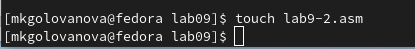{ #fig:008 width=70% }

Я внимательно изучила текст программы листинга 9.2 и ввела его в файл lab9-2.asm (рис. [-@fig:009])

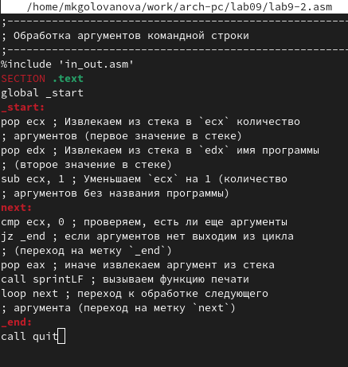{ #fig:009 width=70% }

Я создала исполняемый файл и проверила его работу (рис. [-@fig:010]). Программа обработала 4 аргумента.

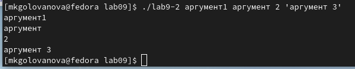{ #fig:010 width=70% }

Я рассмотрела еще один пример программы, которая выводит сумму чисел, которые передаются в программу как аргументы. Я создала файл lab9-3.asm в каталоге ~/work/arch-pc/lab09 (рис. [-@fig:011]) и ввела в него текст программы из листинга 9.3(рис. [-@fig:012])

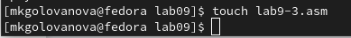{ #fig:011 width=70% }

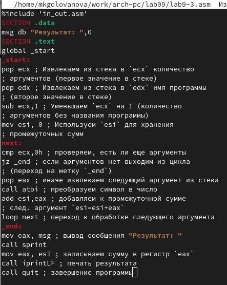{ #fig:012 width=70% }

Я создала исполняемый файл и запустила его, указав аргументы (рис. [-@fig:013])

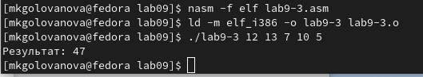{ #fig:013 width=70% }

Я изменила текст программы из листинга 9.3 для вычисления произведения аргументов командной строки (рис. [-@fig:014]).

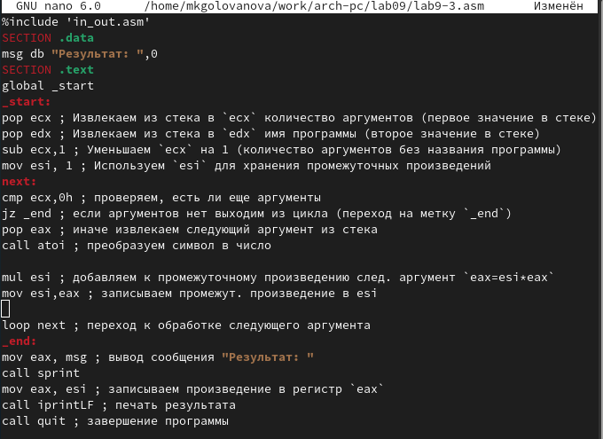{ #fig:014 width=70% }

Я создала новый исполняемый файл и запустила его, указав аргументы (рис. [-@fig:015])

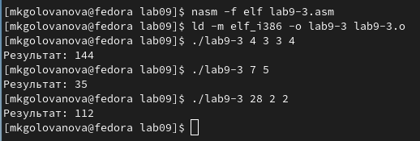{ #fig:015 width=70% }

# Задание для самостоятельной работы

Я написала программу, которая находит сумму значений функции f(x) для x = x1, x2, ..., xn, т.е. программа  выводит значение f(x1) + f(x2) +...+ f(xn). Значения xi передаются как аргументы. Вид функции f(x) я выбрала из таблицы 9.1 вариантов заданий в соответствии с вариантом, полученным при выполнении лабораторной работы №7 (вариант 19). 
Я создала файл lab9-4-var19.asm в каталоге ~/work/arch-pc/lab09 (рис. [-@fig:016]) и ввела в него текст составленной программы (рис. [-@fig:017]).

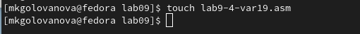{ #fig:016 width=70% }

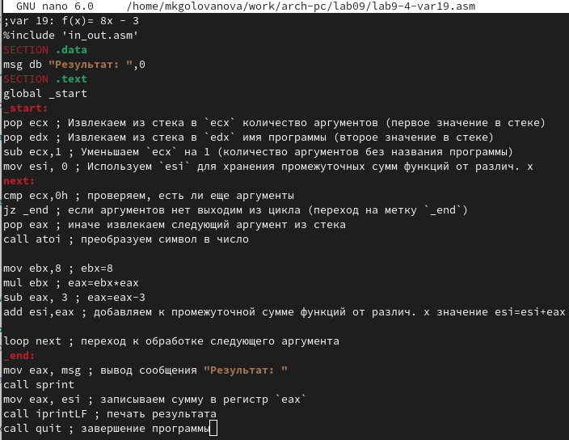{ #fig:017 width=70% }

 Я создала исполняемый файл и проверила его работу на нескольких наборах x = x1, x2, ..., xn (рис. [-@fig:018]).

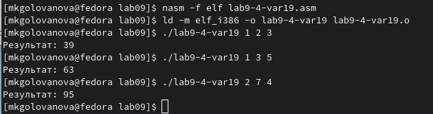{ #fig:018 width=70% }

# Выводы

Я приобрела навыки написания программ с использованием циклов и обработкой аргументов командной строки.

# Список литературы{.unnumbered}

::: {#refs}
:::
