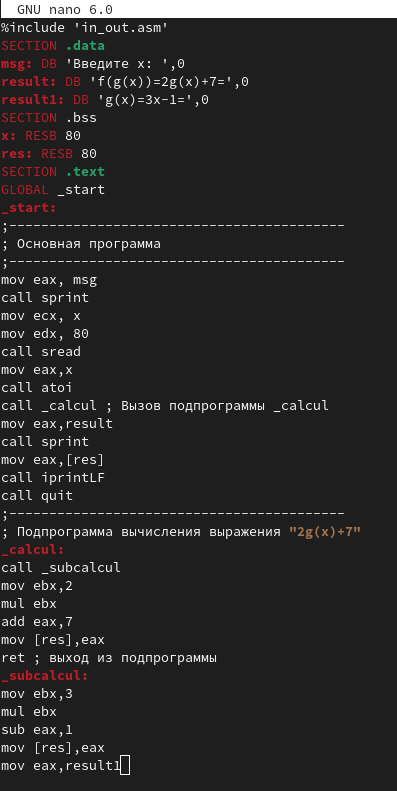

---
## Front matter
title: "Лабораторная работа №10"
subtitle: "Архитектура компьютера"
author: "Голованова Мария Константиновна"

## Generic otions
lang: ru-RU
toc-title: "Содержание"

## Bibliography
bibliography: bib/cite.bib
csl: pandoc/csl/gost-r-7-0-5-2008-numeric.csl

## Pdf output format
toc: true # Table of contents
toc-depth: 2
lof: true # List of figures
lot: true # List of tables
fontsize: 12pt
linestretch: 1.5
papersize: a4
documentclass: scrreprt
## I18n polyglossia
polyglossia-lang:
  name: russian
  options:
	- spelling=modern
	- babelshorthands=true
polyglossia-otherlangs:
  name: english
## I18n babel
babel-lang: russian
babel-otherlangs: english
## Fonts
mainfont: PT Serif
romanfont: PT Serif
sansfont: PT Sans
monofont: PT Mono
mainfontoptions: Ligatures=TeX
romanfontoptions: Ligatures=TeX
sansfontoptions: Ligatures=TeX,Scale=MatchLowercase
monofontoptions: Scale=MatchLowercase,Scale=0.9
## Biblatex
biblatex: true
biblio-style: "gost-numeric"
biblatexoptions:
  - parentracker=true
  - backend=biber
  - hyperref=auto
  - language=auto
  - autolang=other*
  - citestyle=gost-numeric
## Pandoc-crossref LaTeX customization
figureTitle: "Рис."
tableTitle: "Таблица"
listingTitle: "Листинг"
lofTitle: "Список иллюстраций"
lotTitle: "Список таблиц"
lolTitle: "Листинги"
## Misc options
indent: true
header-includes:
  - \usepackage{indentfirst}
  - \usepackage{float} # keep figures where there are in the text
  - \floatplacement{figure}{H} # keep figures where there are in the text
---

# Цель работы

Приобретение навыков написания программ с использованием подпрограмм. Знакомство с методами отладки при помощи GDB и его основными возможностями.

# Задание

Создать программы, вычисляющие результат с использованием подпрограмм. 
Исследовать программы с помощью GDB.

# Теоретическое введение

Подпрограмма — часть компьютерной программы, содержащая описание определённого набора действий, которая может быть многократно вызвана из разных частей программы. 

Отладка — процесс поиска и исправления ошибок в программе. В общем случае его можно разделить на четыре этапа: обнаружение ошибки, поиск её местонахождения, определение причины ошибки и исправление ошибки. Наиболее часто применяют такие методы отладки, как создание точек контроля значений на входе и выходе участка программы (например, вывод промежуточных значений на экран) или использование специальных программ-отладчиков. Отладчики позволяют управлять ходом выполнения программы, контролировать и изменять данные, что помогает быстрее найти место ошибки в программе и ускорить её исправление. Они позволяют увидеть, что происходит «внутри» программы в момент её выполнения или что делает программа в момент сбоя. 
Наиболее известным отладчиком для Linux является программа GNU GDB (GNU Debugger — отладчик проекта GNU). Он работает на многих UNIX-подобных системах и умеет производить отладку многих языков программирования.
Самые популярные способы работы с отладчиком — это использование точек останова и выполнение программы по шагам.

# Выполнение лабораторной работы

## Реализация подпрограмм в NASM

Я создала каталог для выполнения лабораторной работы No 10, перешла в него и создала файл lab10-1.asm (рис. [-@fig:001]).

{ #fig:001 width=70% }

В качестве примера я рассмотрела программу вычисления арифметического выражения f(x) = 2x + 7 с помощью подпрограммы _calcul. В данном примере x вводится с клавиатуры, а само выражение вычисляется в подпрограмме. Я внимательно изучила текст программы из листинга 10.1, ввела его в файл lab10-1.asm, создала исполняемый файл и проверила его работу (рис. [-@fig:002], рис. [-@fig:003]).

{ #fig:002 width=70% }

{ #fig:003 width=70% }

Я изменила текст программы, добавив подпрограмму _subcalcul в подпрограмму _calcul, для вычисления выражения f(g(x)), где x вводится с клавиатуры, f(x) = 2x + 7, g(x) = 3x − 1 (т.е. x передается в подпрограмму _calcul из нее в подпрограмму _subcalcul, где вычисляется выражение g(x), результат возвращается в _calcul и вычисляется выражение f(g(x)), результат возвращается в основную программу для вывода результата на экран) (рис. [-@fig:004], рис. [-@fig:005], рис. [-@fig:006]).

{ #fig:004 width=70% }

{ #fig:005 width=70% }

{ #fig:006 width=70% }

## Отладка программам с помощью GDB

Я создала файл lab10-2.asm и ввела в него текст программы из Листинга 10.2 (Программа печати сообщения Hello world!) (рис. [-@fig:007], рис. [-@fig:008]).

{ #fig:007 width=70% }

{ #fig:008 width=70% }

Я получила исполняемый файл (рис. [-@fig:009]). Для работы с GDB в исполняемый файл необходимо добавить отладочную информацию, для этого трансляцию программ необходимо проводить с ключом ‘-g’.

{ #fig:009 width=70% }

Я загрузила исполняемый файл в отладчик gdb (рис. [-@fig:010]).

{ #fig:010 width=70% }

Я проверила работу программы, запустив ее в оболочке GDB с помощью команды run (сокращённо r) (рис. [-@fig:011]).

{ #fig:011 width=70% }

Для более подробного анализа программы я установила брейкпоинт на метку _start, с которой начинается выполнение любой ассемблерной программы, и запустила программу (рис. [-@fig:012]).

{ #fig:012 width=70% }

Я посмотрела дисассимилированный код программы с помощью команды disassemble начиная с метки _start (рис. [-@fig:013]).

{ #fig:013 width=70% }

Я переключилась на отображение команд с синтаксисом Intel, введя команду set disassembly-flavor intel (рис. [-@fig:014]).

{ #fig:014 width=70% }

При отображении синтаксиса машинных команд регистр и его значение в режиме ATT указывается как $<значение регистра>,%<регистр>, а в режиме Intel - <регистр>,<значение регистра>.

Я включила режим псевдографики для более удобного анализа программы (рис. [-@fig:015]):
(gdb) layout asm
(gdb) layout regs

{ #fig:015 width=70% }

В этом режиме есть три окна:
 в верхней части видны названия регистров и их текущие значения;
 в средней части виден результат дисассимилирования программы;
 нижняя часть доступна для ввода команд.

### Добавление точек останова

Установить точку останова можно командой break (кратко b). Типичный аргумент этой команды — место установки. Его можно задать или как номер строки программы (имеет смысл, если есть исходный файл, а программа компилировалась с информацией об отладке), или как имя метки, или как адрес. Чтобы не было путаницы с номерами, перед адресом ставится «звёздочка».
На предыдущих шагах была установлена точка останова по имени метки (_start). Я проверила это с помощью команды info breakpoints (кратко i b). 
Я определила адрес предпоследней инструкции (mov ebx,0x0), установила точку останова и посмотрела информацию о всех установленных точках останова (рис. [-@fig:016]).

{ #fig:016 width=70% }

### Работа с данными программы в GDB

Отладчик может показывать содержимое ячеек памяти и регистров, а при необходимости позволяет вручную изменять значения регистров и переменных.
Я выполнила 5 инструкций с помощью команды stepi (или si) и проследила за изменением значений регистров. Значения изменяются в регистрах eax, ebx, ecx, edx, eax (повторно) (рис. [-@fig:017]).

{ #fig:017 width=70% }

Посмотреть содержимое регистров также можно с помощью команды info registers (или i r) (рис. [-@fig:018]).

{ #fig:018 width=70% }

Для отображения содержимого памяти можно использовать команду x <адрес>, которая выдаёт содержимое ячейки памяти по указанному адресу. Формат, в котором выводятся данные, можно задать после имени команды через косую черту: x/NFU <адрес>. С помощью команды x &<имя переменной> также можно посмотреть содержимое переменной.
Я посмотрела значение переменной msg1 по имени (рис. [-@fig:019]).

{ #fig:019 width=70% }

Я посмотрела значение переменной msg2 по адресу. Адрес переменной можно определить по дизассемблированной инструкции. Я посмотрела инструкцию mov ecx,msg2, которая записывает в регистр ecx адрес перемененной msg2 (рис. [-@fig:020])

{ #fig:020 width=70% }

Изменить значение для регистра или ячейки памяти можно с помощью команды set, задав ей в качестве аргумента имя регистра или адрес. При этом перед именем регистра ставится префикс $, а перед адресом нужно указать в фигурных скобках тип данных (размер сохраняемого значения; в качестве типа данных можно использовать типы языка Си). Я изменила первый символ переменной msg1 (рис. [-@fig:021])

{ #fig:021 width=70% }

Я заменила первый символ во второй переменной msg2 (рис. [-@fig:022])

{ #fig:022 width=70% }

Я вывела в различных форматах (в шестнадцатеричном формате, в двоичном формате и в символьном виде) значение регистра edx (рис. [-@fig:023]).

{ #fig:023 width=70% }

С помощью команды set я изменила значение регистра ebx (рис. [-@fig:024]).

{ #fig:024 width=70% }

Разницу вывода команд p/s $ebx вызвана тем, что в первом случае значение регистра вводится как символ, а во втором - как цифра.
Я завершила выполнение программы с помощью команды continue (сокращенно c) и вышла из GDB с помощью команды quit (сокращенно q)(рис. [-@fig:025]).

{ #fig:025 width=70% }

### Обработка аргументов командной строки в GDB

Я скопировала файл lab9-2.asm, созданный при выполнении лабораторной работы No9, с программой, выводящей на экран аргументы командной строки (Листинг 9.2), в файл с именем lab10-3.asm и создала исполняемый файл (рис. [-@fig:026]).

{ #fig:026 width=70% }

Для загрузки в gdb программы с аргументами необходимо использовать ключ --args. Загрузите исполняемый файл в отладчик, указав аргументы: 
gdb --args lab10-3 аргумент1 аргумент 2 'аргумент 3' (рис. [-@fig:027]).

{ #fig:027 width=70% }

Как отмечалось в предыдущей лабораторной работе, при запуске программы аргументы командной строки загружаются в стек. Я исследовала расположение аргументов командной строки в стеке после запуска программы с помощью gdb.
Я установила точку останова перед первой инструкцией в программе и запустила её (рис. [-@fig:028]).

{ #fig:028 width=70% }

Адрес вершины стека храниться в регистре esp, и по этому адресу располагается число, равное количеству аргументов командной строки (включая имя программы). Число аргументов равно 5 – это имя программы lab10-3 и непосредственно аргументы: аргумент1, аргумент, 2 и 'аргумент 3'.
Я посмотрела остальные позиции стека – по адесу [esp+4] располагается адрес в памяти где находиться имя программы, по адесу [esp+8] храниться адрес первого аргумента, по аресу [esp+12] – второго и т.д. (рис. [-@fig:029]).

{ #fig:029 width=70% }

Шаг изменения адреса равен 4 ([esp+4], [esp+8], [esp+12] и т.д.), потому что количество команд для выведения каждого аргумента равно 4.

# Выполнение самостоятельной работы

Я преобразовала программу из лабораторной работы №9 (Задание №1 для самостоятельной работы), реализовав вычисление значения функции f(x) как подпрограмму.

В листинге 10.3 приведена программа вычисления выражения (3 + 2) * 4 + 5. При запуске данная программа дает неверный результат. Проверьте это.
С помощью отладчика GDB, анализируя изменения значений регистров, определите ошибку и исправьте ее.

# Выводы

Я приобрела навыки написания программ с использованием подпрограмм и познакомилась с методами отладки при помощи GDB и его основными возможностями.

