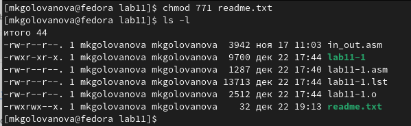

---
## Front matter
title: "Лабораторная работа №11"
subtitle: "Архитектура компьютера"
author: "Голованова Мария Константиновна"

## Generic otions
lang: ru-RU
toc-title: "Содержание"

## Bibliography
bibliography: bib/cite.bib
csl: pandoc/csl/gost-r-7-0-5-2008-numeric.csl

## Pdf output format
toc: true # Table of contents
toc-depth: 2
lof: true # List of figures
lot: true # List of tables
fontsize: 12pt
linestretch: 1.5
papersize: a4
documentclass: scrreprt
## I18n polyglossia
polyglossia-lang:
  name: russian
  options:
	- spelling=modern
	- babelshorthands=true
polyglossia-otherlangs:
  name: english
## I18n babel
babel-lang: russian
babel-otherlangs: english
## Fonts
mainfont: PT Serif
romanfont: PT Serif
sansfont: PT Sans
monofont: PT Mono
mainfontoptions: Ligatures=TeX
romanfontoptions: Ligatures=TeX
sansfontoptions: Ligatures=TeX,Scale=MatchLowercase
monofontoptions: Scale=MatchLowercase,Scale=0.9
## Biblatex
biblatex: true
biblio-style: "gost-numeric"
biblatexoptions:
  - parentracker=true
  - backend=biber
  - hyperref=auto
  - language=auto
  - autolang=other*
  - citestyle=gost-numeric
## Pandoc-crossref LaTeX customization
figureTitle: "Рис."
tableTitle: "Таблица"
listingTitle: "Листинг"
lofTitle: "Список иллюстраций"
lotTitle: "Список таблиц"
lolTitle: "Листинги"
## Misc options
indent: true
header-includes:
  - \usepackage{indentfirst}
  - \usepackage{float} # keep figures where there are in the text
  - \floatplacement{figure}{H} # keep figures where there are in the text
---

# Цель работы

Приобретение навыков написания программ для работы с файлами.

# Задание

Написать программу записи в файл сообщения, изменить права доступа к ней и к файлу.
Написать программу работающую по следующему алгоритму: вывести приглашение “Как Вас зовут?”, ввести с клавиатуры свои фамилию и имя, создать файл с именем name.txt, записать в файл сообщение “Меня зовут”, дописать в файл строку введенную с клавиатуры, закрыть файл.

# Теоретическое введение

Права доступа - специальные механизмы разграничения доступа, которые определяют набор действий, который конкретный пользователь может или не может совершать с определенным файлами и каталогами. 
Права доступа в Linux:
r — read (чтение) — право просматривать содержимое файла;
w — write (запись) — право изменять содержимое файла;
x — execute (выполнение) — право запускать файл, если это программа или скрипт.
В символьном представлении набор прав имеет вид строк rwx, где вместо любого символа может стоять дефис. Также права доступа могут быть представлены как восьмеричное число. 

# Выполнение лабораторной работы

Я создала каталог для программам лабораторной работы No 11, перешла в него и создайте файл lab11-1.asm и readme.txt (рис. [-@fig:001])

{ #fig:001 width=70% }

Я ввела в файл lab11-1.asm текст программы из листинга 11.1 (Программа записи в файл сообщения) (рис. [-@fig:002]). 

{ #fig:002 width=70% }

Я создала исполняемый файл и проверила его работу (рис. [-@fig:003]).

{ #fig:003 width=70% }

С помощью команды chmod я изменила права доступа к исполняемому файлу lab11-1, запретив его выполнение (рис. [-@fig:004]), и попыталась выполнить файл. Так как я ограничила права доступа к нему, то он не может быть запущен.

{ #fig:004 width=70% }

С помощью команды chmod я изменила права доступа к файлу lab11-1.asm с исходным текстом программы, добавив права на исполнение (рис. [-@fig:005]), и попыталась выполнить его. Так как я предоставила права на исполнение файла, он был исполнен.

{ #fig:005 width=70% }

Я предоставила права доступа к файлу readme.txt в соответствии с вариантом №19 в таблице 11.4 и проверила правильность выполнения с помощью команды ls -l (рис. [-@fig:006], рис. [-@fig:007]).

{ #fig:006 width=70% }

{ #fig:007 width=70% }

# Выполнение самостоятельной  работы

Я написала программу работающую по следующему алгоритму: вывести приглашение “Как Вас зовут?”, ввести с клавиатуры свои фамилию и имя, создать файл с именем name.txt, записать в файл сообщение “Меня зовут”, дописать в файл строку введенную с клавиатуры, закрыть файл (рис. [-@fig:008], рис. [-@fig:009]).

{ #fig:008 width=70% }

{ #fig:009 width=60% }

Я создала исполняемый файл и проверила его работу, а также проверила наличие файла name.txt и его содержимое с помощью команд ls и cat.(рис. [-@fig:010])

{ #fig:010 width=85% }

# Выводы

Я приобрела навыки написания программ для работы с файлами.

